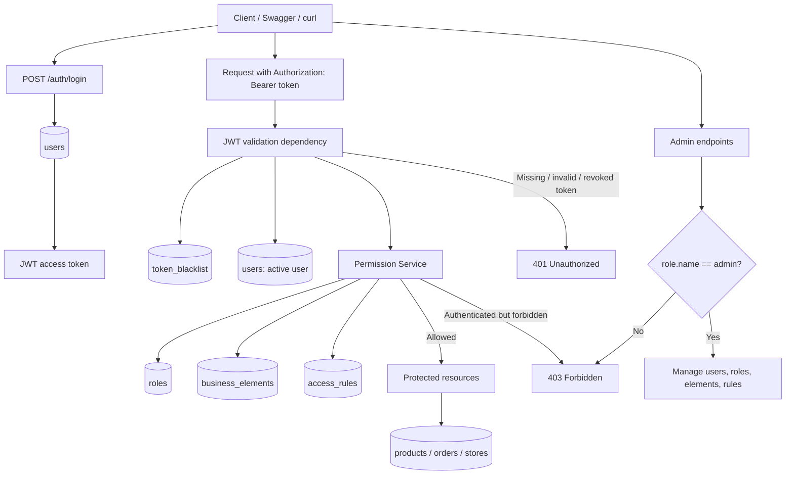

# Custom Auth Access Control API

[Русская версия](README.ru.md)

## Краткое описание на русском

Backend-приложение на FastAPI для технического задания: собственная система
аутентификации и авторизации с JWT-токенами, ролями и правилами доступа,
хранящимися в базе данных.

Основные возможности:

- Регистрация, login, logout, обновление профиля и мягкое удаление аккаунта
- JWT-аутентификация через `Authorization: Bearer <token>`
- Роли `admin`, `manager`, `user`, `guest`
- Таблицы `business_elements` и `access_rules` для собственной модели доступа
- Ответы `401 Unauthorized` и `403 Forbidden`
- Admin API для управления ролями, бизнес-элементами и правилами доступа
- Mock-ресурсы `products`, `orders`, `stores` с `owner_id`

Полная русская версия: [README.ru.md](README.ru.md)

## English README

Production-like FastAPI backend for a technical assignment. It implements JWT authentication and a custom database-backed authorization model instead of relying on framework permissions.

## Stack

- Python 3.12
- FastAPI with OpenAPI docs at `/docs`
- PostgreSQL
- SQLAlchemy 2.0
- Alembic
- Pydantic v2
- JWT access tokens
- bcrypt/passlib password hashing
- Docker and docker-compose
- pytest

## Authentication vs Authorization

Authentication answers: "Who is making this request?"

This API authenticates users with email and password, returns a signed JWT access token, and identifies future requests through `Authorization: Bearer <token>`.

Authorization answers: "What is this authenticated user allowed to do?"

This API stores roles, business elements, and access rules in the database. The permission service checks the user's role against the target business element and requested action.

## Architecture Diagram / Диаграмма архитектуры

The diagram below shows how authentication, JWT validation, custom permission checks, admin endpoints, and protected business resources interact.

Диаграмма ниже показывает, как взаимодействуют аутентификация, проверка JWT, собственная система прав доступа, административные эндпоинты и защищённые бизнес-ресурсы.



PlantUML source: [`docs/auth_authorization_flow.puml`](docs/auth_authorization_flow.puml)

## Database Schema

Core auth tables:

- `users`: profile fields, email, hashed password, active flag, and `role_id`.
- `roles`: role records such as `admin`, `manager`, `user`, and `guest`.
- `business_elements`: protected domains such as `users`, `products`, `orders`, `stores`, and `access_rules`.
- `access_rules`: per-role permissions for each business element.
- `token_blacklist`: revoked JWT IDs used for logout and soft delete.

Mock business tables:

- `products`
- `orders`
- `stores`

Each mock business table has `owner_id`, so basic permissions can be restricted to objects owned by the current user.

## Access Control Model

`access_rules` contains:

- `read_permission`
- `read_all_permission`
- `create_permission`
- `update_permission`
- `update_all_permission`
- `delete_permission`
- `delete_all_permission`

Rules:

- Missing or invalid JWT returns `401`.
- Valid user without permission returns `403`.
- `*_all_permission` allows the action on all objects for that business element.
- Basic permission without `*_all_permission` allows the action only when `object.owner_id == current_user.id`.
- Admin API endpoints require the `admin` role.

## Run Locally With Docker

Create an environment file:

```bash
cp .env.example .env
```

Start the API and PostgreSQL:

```bash
make up
```

PostgreSQL is available only inside the Docker Compose network at `db:5432`; it is not published to a host port.

Apply migrations:

```bash
make migrate
```

Seed roles, users, rules, and sample business objects:

```bash
make seed
```

Run tests:

```bash
make test
```

## Seed Credentials

- Admin: `admin@example.com` / `Admin123!`
- Manager: `manager@example.com` / `Manager123!`
- User: `user@example.com` / `User123!`

## API Examples

Login:

```bash
curl -X POST http://localhost:8000/auth/login \
  -H "Content-Type: application/json" \
  -d '{"email":"admin@example.com","password":"Admin123!"}'
```

Use the returned token:

```bash
TOKEN="<access_token>"
curl http://localhost:8000/auth/me \
  -H "Authorization: Bearer $TOKEN"
```

Register:

```bash
curl -X POST http://localhost:8000/auth/register \
  -H "Content-Type: application/json" \
  -d '{
    "first_name":"Jane",
    "last_name":"Doe",
    "middle_name":null,
    "email":"jane@example.com",
    "password":"Password123!",
    "password_repeat":"Password123!"
  }'
```

Create a product:

```bash
curl -X POST http://localhost:8000/products \
  -H "Authorization: Bearer $TOKEN" \
  -H "Content-Type: application/json" \
  -d '{"name":"Desk","description":"Standing desk","price":"399.00","stock":3}'
```

List products:

```bash
curl http://localhost:8000/products \
  -H "Authorization: Bearer $TOKEN"
```

Logout:

```bash
curl -X POST http://localhost:8000/auth/logout \
  -H "Authorization: Bearer $TOKEN"
```

List users as admin:

```bash
curl http://localhost:8000/admin/users \
  -H "Authorization: Bearer $TOKEN"
```

## Production Notes / Future Improvements

The current implementation intentionally stays focused on the assignment scope. For a larger production system, the next improvements would be:

- Refresh token rotation for longer-lived sessions without changing access token semantics.
- Rate limiting for login and other sensitive endpoints.
- Audit logging for authentication events and admin changes to access rules.
- Cleanup of expired blacklisted tokens with a scheduled job or maintenance command.
- Pagination metadata, such as total count and next/previous offsets, while preserving list endpoints where needed.
- Structured logging for request tracing, security events, and operational debugging.

## Assignment Checklist

- [x] User registration with profile fields and repeated password validation
- [x] Login with JWT access token
- [x] Bearer token authentication dependency
- [x] Logout with token blacklist
- [x] Update own profile
- [x] Soft delete own account
- [x] Users, roles, business elements, and access rules tables
- [x] Custom permission checking service
- [x] `401` vs `403` behavior
- [x] Admin CRUD for roles, business elements, and access rules
- [x] Admin user listing
- [x] Products, orders, and stores mock database resources with `owner_id`
- [x] Seed script
- [x] Docker, docker-compose, Alembic, pytest, `.env.example`, Makefile
