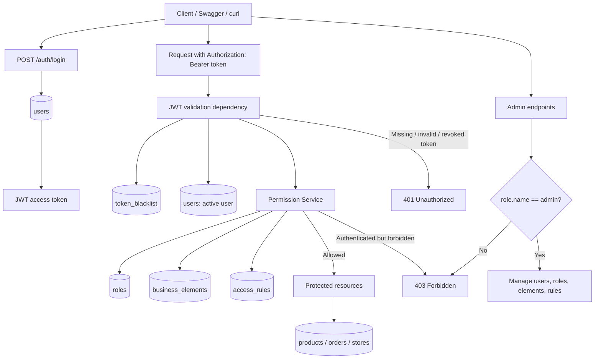

# Custom Auth Access Control API

[English README](README.md)

## README (Русская версия)

Backend-приложение на FastAPI для технического задания: собственная система
аутентификации и авторизации с JWT-токенами, ролями и правилами доступа,
хранящимися в базе данных. Проект не основан полностью на готовых
permission-механизмах фреймворка.

## Технологии

- FastAPI
- PostgreSQL
- JWT-аутентификация
- Система ролей и прав доступа
- Docker и docker-compose
- Alembic
- SQLAlchemy 2.0
- Pydantic v2
- pytest

## Основные возможности

- Регистрация пользователя
- Вход в систему
- Выход из системы с blacklist JWT-токена
- Обновление профиля
- Мягкое удаление аккаунта через `is_active=False`
- RBAC-модель доступа с таблицами `roles`, `business_elements`, `access_rules`
- CRUD для ролей, бизнес-элементов и правил доступа доступен только admin
- Mock-ресурсы `products`, `orders`, `stores` с `owner_id`
- Корректные ответы `401 Unauthorized` и `403 Forbidden`

## Диаграмма архитектуры

Диаграмма ниже показывает, как взаимодействуют аутентификация, проверка JWT,
собственная система прав доступа, административные эндпоинты и защищённые
бизнес-ресурсы.



PlantUML source: [`docs/auth_authorization_flow.puml`](docs/auth_authorization_flow.puml)

## Аутентификация и авторизация

Аутентификация отвечает на вопрос: "Кто выполняет запрос?"

Пользователь входит по email и паролю. После успешного login API возвращает
JWT access token. Следующие запросы идентифицируют пользователя через header
`Authorization: Bearer <token>`.

Авторизация отвечает на вопрос: "Что этому пользователю разрешено делать?"

Права доступа хранятся в базе данных через роли, бизнес-элементы и правила.
Permission service проверяет роль пользователя, защищённый ресурс и действие.

## Схема базы данных

Основные таблицы:

- `users`: профиль, email, hashed password, статус активности и `role_id`.
- `roles`: роли `admin`, `manager`, `user`, `guest`.
- `business_elements`: защищённые элементы `users`, `products`, `orders`, `stores`, `access_rules`.
- `access_rules`: правила доступа роли к бизнес-элементу.
- `token_blacklist`: отозванные JWT-токены для logout и soft delete.

Mock-таблицы бизнес-ресурсов:

- `products`
- `orders`
- `stores`

Каждый mock-ресурс содержит `owner_id`, поэтому базовые права применяются
только к объектам владельца, а права с `_all_permission` применяются ко всем
объектам.

## Модель доступа

Таблица `access_rules` содержит:

- `read_permission`
- `read_all_permission`
- `create_permission`
- `update_permission`
- `update_all_permission`
- `delete_permission`
- `delete_all_permission`

Правила:

- Если JWT отсутствует, недействителен, отозван или пользователь неактивен, возвращается `401`.
- Если пользователь найден, но прав недостаточно, возвращается `403`.
- `*_all_permission` разрешает действие над всеми объектами бизнес-элемента.
- Обычный `*_permission` без `*_all_permission` разрешает действие только над объектами, где `owner_id == current_user.id`.
- Административные эндпоинты требуют роль `admin`.

## Запуск проекта

```bash
cp .env.example .env
make up
make migrate
make seed
```

PostgreSQL доступен только внутри Docker Compose сети по адресу `db:5432` и
не публикуется на host-порт.

Swagger UI доступен по адресу `http://localhost:8000/docs`.

## Тестовые пользователи

- `admin@example.com` / `Admin123!` -> `admin`
- `manager@example.com` / `Manager123!` -> `manager`
- `user@example.com` / `User123!` -> `user`

## Проверка тестов

```bash
DATABASE_URL=sqlite:///./test.db pytest
```

## Производственные заметки / будущие улучшения

Текущая реализация намеренно сфокусирована на требованиях технического задания.
Для более крупной production-системы следующими улучшениями могли бы быть:

- Ротация refresh-токенов для долгих сессий без изменения семантики access token.
- Rate limiting для login и других чувствительных эндпоинтов.
- Audit logging для событий аутентификации и изменений правил доступа администратором.
- Очистка истёкших токенов из `token_blacklist` через scheduled job или maintenance command.
- Метаданные пагинации, например total count и next/previous offset.
- Structured logging для трассировки запросов, security events и operational debugging.
